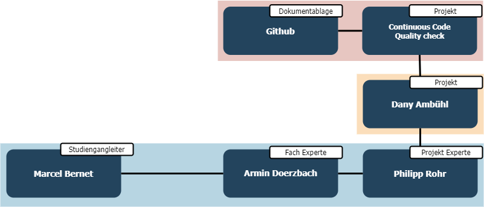

## Projektaufbauorganisation

Diese Seite beschreibt die Organisation meines Projekts und die Struktur meines Scrum-Teams.
Die folgende Grafik stellt den Aufbau meines Projektes dar.

---

## Team Struktur

Und hier ist die Struktur meines Scrum-Teams, in der die Rollen der einzelnen Personen sowie ihre Beziehungen zueinander dargestellt werden.

---

## Scrum Team Rollen

### Product Owner

Der Product Owner ist verantwortlich für die Maximierung des Wertes des Produkts und die Arbeit des Entwicklungsteams. Er ist der Hauptverantwortliche für die Entwicklung und Umsetzung des Projekts.

### Scrum Master

Der Scrum Master ist verantwortlich für die Einhaltung der Scrum-Regeln und -Praktiken. Er unterstützt das Team bei der Umsetzung der agilen Methoden und sorgt für eine effiziente arbeiten.

### Expert

Die Experten sind verantwortlich für die Unterstützung und Bewertung des Projekts. Sie geben Feedback und beraten das Team bei der Umsetzung.

### Entwickler

Die Entwickler schreiben Ansible Playbooks
