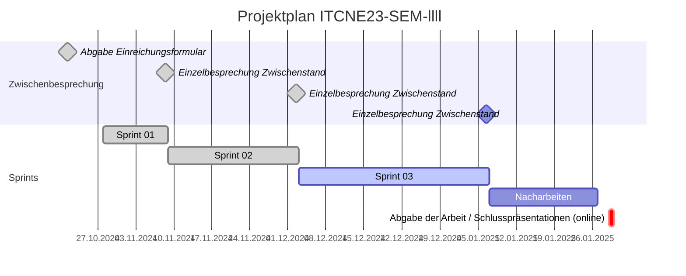

## Sprint 03

| Datum       | Aktivität                                         |
|-------------|---------------------------------------------------|
| 21.10.2024  | Abgabe und Besprechung Einreichungsformular Semesterarbeit  |
| 08.11.2024  | Ergebnis 1. Sprint                                |
| 02.12.2024  | Ergebnis 2. Sprint                                |
| 06.01.2025  | Ergebnis 3. Sprint                                |
| 29.01.2025  | Abgabe der Arbeit / Abnahme                       |

### Sprint Planning

Folgende Tasks wurden im Sprint 03 geplant:

### Sprint Review

Folgende Tasks wurden im Sprint 03 bearbeitet:

### Sprint Retrospektive

**Keep** Was soll beibehalten werden?

- 

**Drop** Mit was soll ich aufhören?

- 

**Try** Was soll ich im nächsten Sprint ausprobieren?

- 
