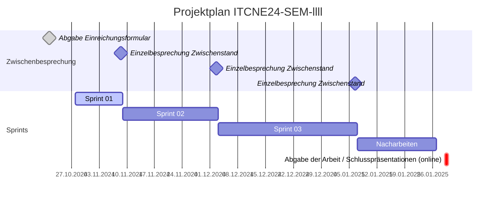

## Sprint 01

| Datum       | Aktivität                                         |
|-------------|---------------------------------------------------|
| 21.10.2024  | Abgabe und Besprechung Einreichungsformular Semesterarbeit  |
| 08.11.2024  | Ergebnis 1. Sprint                                |
| 02.12.2024  | Ergebnis 2. Sprint                                |
| 06.01.2025  | Ergebnis 3. Sprint                                |
| 29.01.2025  | Abgabe der Arbeit / Abnahme                       |

### Sprint Planning

Folgende Tasks wurden im Sprint 01 geplant:

### Sprint Review

Folgende Tasks wurden im Sprint 01 bearbeitet:

### Sprint Retrospektive

#### Projektmanagement

Während dieses Sprints wurde ein erheblicher Aufwand betrieben, um alle projektspezifischen Dokumente im Bereich Projektmanagement zu erstellen dazu gehören NABC-Analyse, Stakeholder-Analyse, SWOT Analyse, Erhebungstechniken und Risikoanalyse. Dieser Aufwand hat sich als sehr zeitaufwändig herausgestellt da viele Dokumente von Grund auf neu erstellt werden mussten.

#### Fazit

Dies wurde bewusst so gehandhabt, basierend auf den Schlussfolgerungen der letzten Semesterarbeit. Der Bewertungsraster legt grossen Wert auf Projektmanagement, wodurch nur wenige Punkte von den Fachexperten vergeben werden konnten. Ich hoffe, den Aufwand bei zukünftigen Arbeiten reduzieren zu können, da dann bereits Dokumentvorlagen vorhanden sind und wieder mehr Zeit zu haben, um mich auf das Wesentliche zu konzentrieren, nämlich die Umsetzung.

**Keep** Was soll beibehalten werden?

- Zu jedem Task wurde ein Issue erstellt
- Die Issues wurden in der Sprint Backlog Liste priorisiert
- Projektmanagement-Tool wurde effizient genutzt
- Viele Mermaid-Diagramme wurden erstellt

**Drop** Mit was sollen ich aufhören?

- Zeitaufwand bei der Dokumentenerstellung

**Try** Was soll ich im nächsten Sprint ausprobieren?

- Einführung von Dokumentvorlagen zur Beschleunigung der Erstellung
