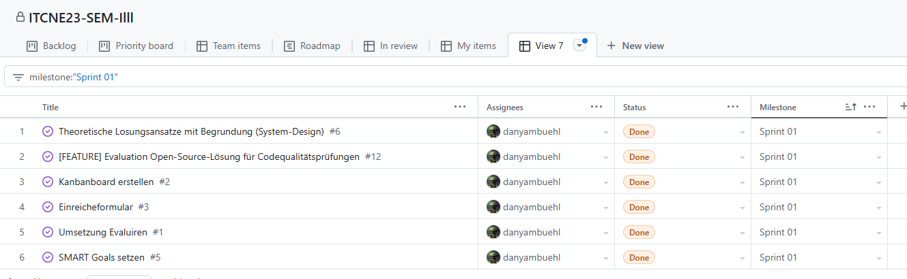

## Sprint 01

| Datum       | Aktivität                                         |
|-------------|---------------------------------------------------|
| 21.10.2024  | Abgabe und Besprechung Einreichungsformular Semesterarbeit  |
| 08.11.2024  | Ergebnis 1. Sprint                                |
| 02.12.2024  | Ergebnis 2. Sprint                                |
| 06.01.2025  | Ergebnis 3. Sprint                                |
| 29.01.2025  | Abgabe der Arbeit / Abnahme                       |

### Sprint Planning

Folgende Tasks wurden im Sprint 01 geplant:

### Sprint Review

Folgende Tasks wurden im Sprint 01 bearbeitet:

### Sprint Retrospektive

#### Projektmanagement

In diesem Sprint wurde das Projektmanagement-Tool effizient genutzt. Alle Tasks wurden in Issues erstellt und in der Sprint Backlog Liste priorisiert.
Das Projektmanagement hat gut funktioniert und die Issues wurden effizient bearbeitet.

#### Kubernetes

Das Deployment von SonarQube auf Kubernetes hat sich als herausfordernd erwiesen. Es gab Probleme mit der Konfiguration und der Bereitstellung der Persistent Volume Claims.
Dabei war die fehlende Praxiserfahrung im Umgang mit Kubernetes ein Hindernis. Es war sehr zeitaufwändig, die Probleme zu lösen.

#### Fazit

Das Projektmanagement konnte dieses mal effizienter durchgeführt werden. Und ich konnte mich auf die Umsetzung der Tasks konzentrieren.

**Keep** Was soll beibehalten werden?

- Zu jedem Task wurde ein Issue erstellt
- Projektmanagement-Tool wurde effizient genutzt
- Mermaid-Diagramme wurden für die Visualisierung verwendet
- Helm-Charts wurden für die Kubernetes-Deployment verwendet

**Drop** Mit was sollen ich aufhören?

- Verzicht von Manuellen Manifest-Dateien für Kubernetes-Deployment
- Verzicht von manuellen Konfigurationen für SonarQube

**Try** Was soll ich im nächsten Sprint ausprobieren?

- CSpell für die Rechtschreibprüfung in Dokumentation und Code verwenden
