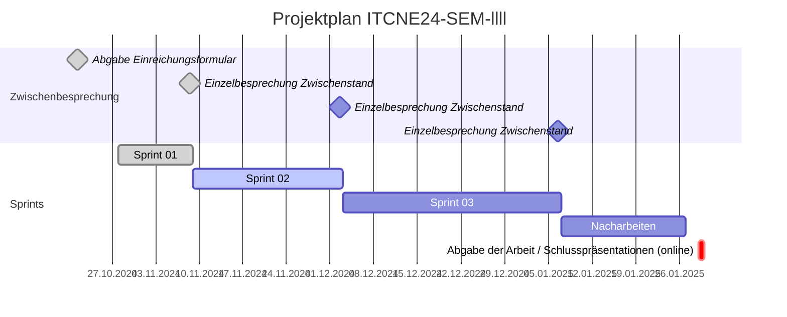
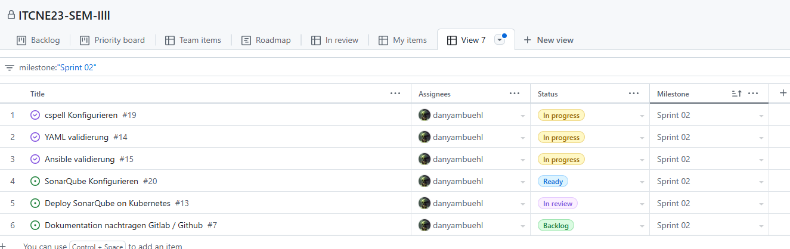

## Sprint 02

| Datum       | Aktivität                                         |
|-------------|---------------------------------------------------|
| 21.10.2024  | Abgabe und Besprechung Einreichungsformular Semesterarbeit  |
| 08.11.2024  | Ergebnis 1. Sprint                                |
| 02.12.2024  | Ergebnis 2. Sprint                                |
| 06.01.2025  | Ergebnis 3. Sprint                                |
| 29.01.2025  | Abgabe der Arbeit / Abnahme                       |

### Sprint Planning

Folgende Tasks wurden im Sprint 02 geplant:

### Sprint Review

Folgende Tasks wurden im Sprint 02 bearbeitet:

### Sprint Retrospektive

#### Kubernetes

Anfangs war die Konfiguration von Kubernetes sehr aufwendig. Da ich die Manifeste selber schreiben wollte.
Nachdem ich begonnen habe, Helm Charts zu verwenden, wurde die Konfiguration einfacher und effizienter.
Dabei können auch hier Optionen angepasst werden, um die Konfiguration zu individualisieren.

#### SonarQube

Die Implementierung von SonarQube war sehr einfach. Jedoch ist meiner Meinung die Benutzeroberfläche nicht sehr intuitiv.
Die Auswertung der Codequalität ist jedoch sehr hilfreich und gibt gute Hinweise, wie der Code verbessert werden kann.

#### Ansible / YAML Validation

Ich habe schlussendlich entschieden, SonarQube Plugin für Ansible und YAML zu verwenden.

#### Fazit

Insgesamt war der Sprint sehr erfolgreich. Habe dabei gelernt mich zuerst zu informieren, bevor ich beginne, etwas zu konfigurieren. Und falls vorhanden, bestehende Lösungen zu verwenden und diese zu individualisieren.

**Keep** Was soll beibehalten werden?

- Helm Charts verwenden
- Drive für die Dokumentation verwenden
- Vorlagen verwenden

**Drop** Mit was soll ich aufhören?

- Manifeste selber schreiben

**Try** Was soll ich im nächsten Sprint ausprobieren?

- Zuerst informieren, bevor ich beginne, etwas zu konfigurieren
