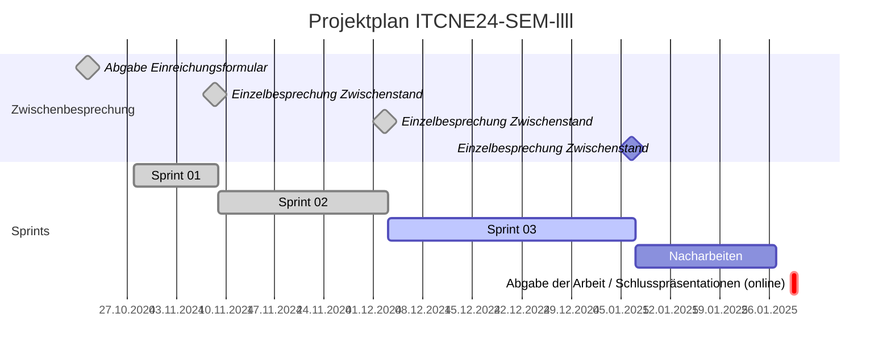
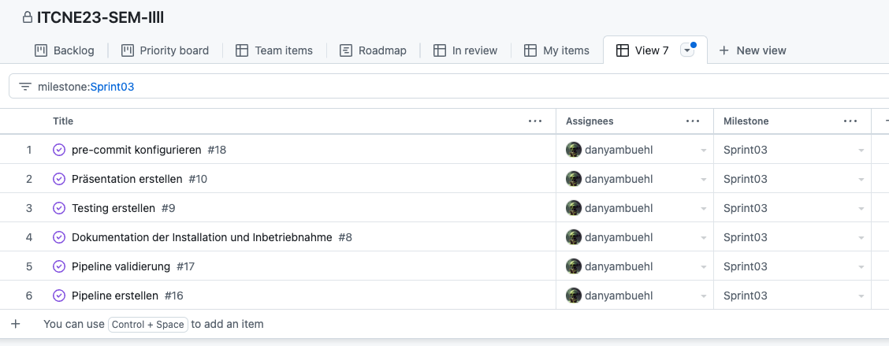
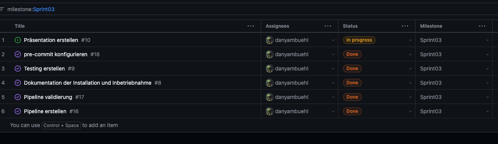

## Sprint 03

| Datum       | Aktivität                                         |
|-------------|---------------------------------------------------|
| 21.10.2024  | Abgabe und Besprechung Einreichungsformular Semesterarbeit  |
| 08.11.2024  | Ergebnis 1. Sprint                                |
| 02.12.2024  | Ergebnis 2. Sprint                                |
| 06.01.2025  | Ergebnis 3. Sprint                                |
| 29.01.2025  | Abgabe der Arbeit / Abnahme                       |

### Sprint Planning

Folgende Tasks wurden im Sprint 03 geplant:

### Sprint Review

Folgende Tasks wurden im Sprint 03 bearbeitet:

### Sprint Retrospektive

#### GitLab CI/CD

Zunächst habe ich sehr komplexe Pipelines erstellt, die ich nach Tests und besserem Verständnis vereinfachen konnte. Dadurch habe ich begonnen, die Pipeline-Templates unseres Unternehmens zu verstehen und anzuwenden. Zudem habe ich die Möglichkeit entdeckt, Sub-Pipelines zu nutzen, um die Struktur der Pipelines weiter zu optimieren.

#### Pre-Commit Hooks

Ich habe viel Zeit investiert, um verschiedene Pre-Commit Hooks zu testen und zu implementieren. Dabei habe ich festgestellt, dass Pre-Commit Hooks sehr effizient sind, um die Codequalität zu verbessern. Allerdings kann die anfängliche Einrichtung sehr zeitaufwendig sein.
Ich verwende nun Pre-Commit Hooks in all meinen Projekten, um die Codequalität und Dokumentation zu verbessern.

#### CSpell

CSpell ist ein sehr nützliches Tool, um Rechtschreibfehler in Markdown-Dateien zu finden. Ich habe es in meine Pre-Commit Hooks integriert, um Rechtschreibfehler in meinen Dokumenten zu vermeiden.

**Keep** Was soll beibehalten werden?

- Templates nutzen
- Sub-Pipelines nutzen

**Drop** Mit was soll ich aufhören?

- Zu genau ins Detail gehen
- Zeit mit der Konfiguration von CSpell und Pre-Commit Hooks investieren

**Try** Was soll ich im nächsten Sprint ausprobieren?

- Weitere Hooks ausprobieren
- Pipeline-Templates entdecken
