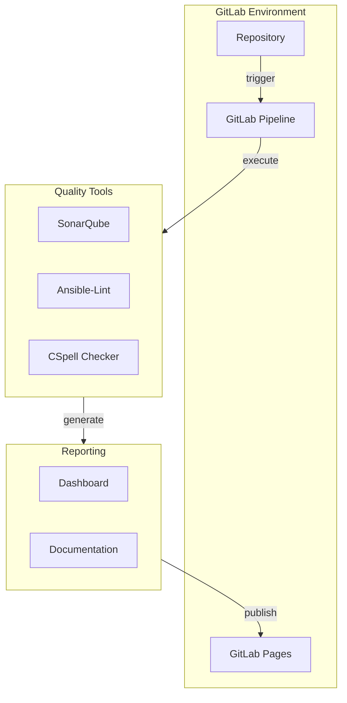

## Theoretischer Lösungsansatz

Die in der Planung erarbeiteten Anforderungen und Ziele sollen in diesem Kapitel in einem theoretischen Lösungsansatz zusammengefasst werden.
Dieser Lösungsansatz soll die Grundlage für die spätere Umsetzung bilden.

Im Prinzip soll das System die Möglichkeit bieten, Ansible-Playbooks und YAML-Dateien automatisiert auf Qualität und Standards zu prüfen.
Sobald Code in das Repository eingecheckt wird, sollen automatische Prüfungen durchgeführt und die Ergebnisse präsentiert werden.

Die Integration in den Entwicklungsprozess soll durch Pre-Commit Hooks erfolgen, die die Entwickler bei der Einhaltung der Standards unterstützen.

### Architektur

Für das Projekt wird eine Open-Source-Lösung implementiert, die folgende Komponenten umfasst:

- **Codequalitätsprüfung**: Integration von SonarQube als primäres Tool für die Codeanalyse
- **Infrastruktur**: Verwendung von k3s als Kubernetes-Distribution für die Bereitstellung der Plattform
- **Ansible-Lint**: Spezifische Prüfung für Ansible-Playbooks
- **YAML-Validierung**: Standardisierung und Überprüfung von YAML-Dateien
- **CI/CD-Pipeline**: Automatisierte Ausführung der Prüfungen bei jedem Commit

### Tools und Technologien

- **GitLab Pipeline**: Für die Implementierung der CI/CD-Pipeline
- **SonarQube**: Für die statische Codeanalyse
- **SonarScanner**: Für die Integration von SonarQube in den Build-Prozess
- **Sonar-Ansible-plugin**: Für die spezifische Prüfung von Ansible-Playbooks
- **YAML SonarQube Plugin**: Für die Überprüfung von YAML-Dateien
- **Pre-commit**: Für die Integration von Prüfungen in den Entwicklungsprozess
- **CSpell**: Für die Rechtschreibprüfung in Code, Dokumentationen und Kommentaren

### Automatisierung

Die Plattform wird vollständig automatisiert:

- Automatische Ausführung bei jedem Push in das Repository
- Automatische Erstellung von Reports und Dashboards
- Hilfestellung im Entwicklungsprozess durch Pre-Commit Hooks

### Monitoring und Reporting

- Generierung von detaillierten Berichten über gefundene Probleme
- Nachvollziehbarkeit der Änderungen über Zeit
- Dashboard für die Visualisierung der Codequalität
- Trendanalysen über Zeit

## Service Design

<!-- /* cSpell:disable */ -->

<!-- /* cSpell:enable */ -->

## Begründung

Der gewählte Lösungsansatz bietet mehrere Vorteile:

- Integration in bestehende Entwicklungsprozesse durch GitLab Pipeline
- Automatisierte Qualitätssicherung ohne manuelle Eingriffe
- Standardisierung durch vordefinierte Regeln
- Transparente Dashboards und Berichte für Entwickler und Management
- Skalierbarkeit durch Kubernetes-Plattform
- Flexibilität durch Open-Source-Tools und Plugins
- Unterstützung für verschiedene Sprachen und Technologien
- Verbesserung der Codequalität und Lesbarkeit
- Frühzeitige Erkennung von Fehlern und Problemen
- Effiziente Zusammenarbeit im Team
- Erhöhung der Produktivität und Qualität
- Reduzierung von manuellen Aufwänden und Fehlern
- Kontinuierliche Verbesserung der Prozesse und Ergebnisse
- Erfüllung von Qualitätsstandards und Best Practices
- Einhaltung von Sicherheitsrichtlinien und Compliance-Vorgaben
