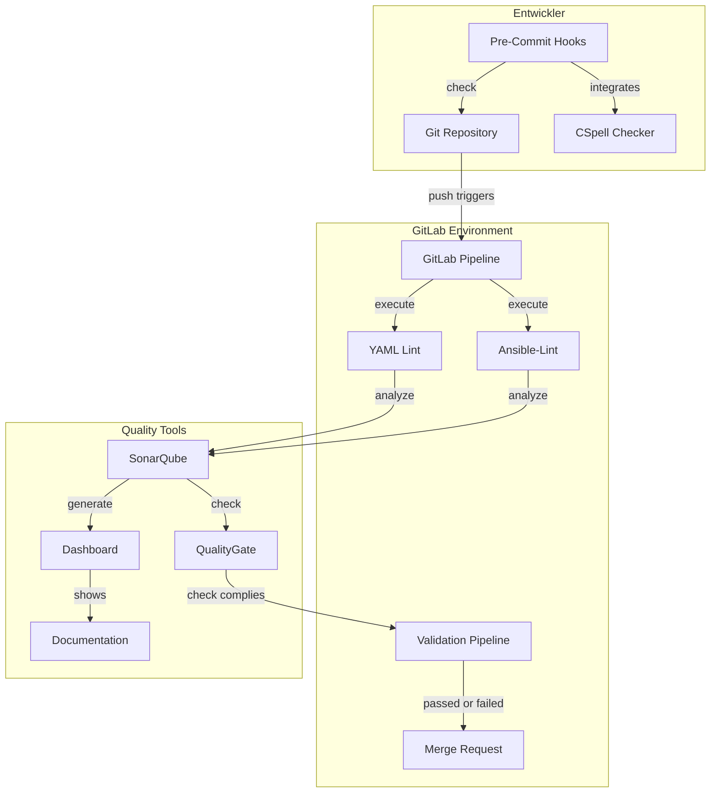

## Theoretischer Lösungsansatz

Die in der Planung erarbeiteten Anforderungen und Ziele sollen in diesem Kapitel in einem theoretischen Lösungsansatz zusammengefasst werden.
Dieser Lösungsansatz soll die Grundlage für die spätere Umsetzung bilden.

Im Prinzip soll das System die Möglichkeit bieten, Ansible-Playbooks und YAML-Dateien automatisiert auf Qualität und Standards zu prüfen.
Sobald Code in das Repository eingecheckt wird, sollen automatische Prüfungen durchgeführt und die Ergebnisse präsentiert werden.

Die Integration in den Entwicklungsprozess soll durch Pre-Commit Hooks erfolgen, die die Entwickler bei der Einhaltung der Standards unterstützen.

### Architektur

Für das Projekt wird eine Open-Source-Lösung implementiert, die folgende Komponenten umfasst:

- **Codequalitätsprüfung**: Integration von SonarQube als primäres Tool für die Codeanalyse
- **Infrastruktur**: Verwendung von k3s als Kubernetes-Distribution für die Bereitstellung der Plattform
- **Ansible-Lint**: Spezifische Prüfung für Ansible-Playbooks
- **YAML-Validierung**: Standardisierung und Überprüfung von YAML-Dateien
- **CI/CD-Pipeline**: Automatisierte Ausführung der Prüfungen bei jedem Commit

### Tools und Technologien

- **GitLab Pipeline**: Für die Implementierung der CI/CD-Pipeline
- **SonarQube**: Für die statische Codeanalyse
- **SonarScanner**: Für die Integration von SonarQube in den Build-Prozess
- **Sonar-Ansible-plugin**: Für die spezifische Prüfung von Ansible-Playbooks
- **YAML SonarQube Plugin**: Für die Überprüfung von YAML-Dateien
- **Pre-commit**: Für die Integration von Prüfungen in den Entwicklungsprozess
- **CSpell**: Für die Rechtschreibprüfung in Code, Dokumentationen und Kommentaren

### Automatisierung

Die Plattform wird vollständig automatisiert:

- Automatische Ausführung der Pipeline bei jedem Push in das Repository
- Integration von SonarQube in die GitLab Pipeline
- Automatisierte Überprüfung von Ansible-Playbooks und YAML-Dateien
- Automatische Erstellung von Reports und Dashboards
- Quality Gates automatisiertes ablehnen oder akzeptieren von Merge Requests
- Hilfestellung im Entwicklungsprozess durch Pre-Commit Hooks und CSpell

### Monitoring und Reporting

- Generierung von detaillierten Berichten über gefundene Probleme
- Nachvollziehbarkeit der Änderungen über Zeit
- Dashboard für die Visualisierung der Codequalität
- Trendanalysen über Zeit

## Service Design

<!-- /* cSpell:disable */ -->

<!-- /* cSpell:enable */ -->

## Begründung

Der gewählte Lösungsansatz bietet mehrere Vorteile:

### Integration und Automatisierung

- **Integration in bestehende Entwicklungsprozesse**: Nahtlose Einbindung durch GitLab Pipeline.
- **Automatisierte Qualitätssicherung**: Reduziert manuelle Eingriffe und erhöht die Effizienz.

### Standardisierung und Transparenz

- **Standardisierung**: Durch vordefinierte Regeln wird eine einheitliche Codequalität sichergestellt.
- **Transparente Dashboards und Berichte**: Bieten klare Einblicke für Entwickler und Management.

### Skalierbarkeit und Flexibilität

- **Skalierbarkeit**: Nutzung der Kubernetes-Plattform ermöglicht einfache Skalierung.
- **Flexibilität**: Einsatz von Open-Source-Tools und Plugins für verschiedene Anforderungen.

### Unterstützung und Verbesserung

- **Unterstützung für verschiedene Sprachen und Technologien**: Breite Kompatibilität für zukünftige Projekte.
- **Verbesserung der Codequalität und Lesbarkeit**: Durch kontinuierliche Überprüfung
- **Schnelle Feedback schleifen**: Sofortige Rückmeldung für Entwickler und Teams.

### Zusammenarbeit und Produktivität

- **Effiziente Zusammenarbeit im Team**: Bessere Kommunikation und Koordination.
- **Erhöhung der Produktivität und Qualität**: Durch automatisierte Prozesse und klare Standards.

### Fehlerreduktion und Sicherheit

- **Frühzeitige Erkennung von Fehlern und Problemen**: Minimiert Risiken und verbessert die Stabilität.
- **Reduzierung von manuellen Aufwänden und Fehlern**: Automatisierung reduziert menschliche Fehler.
- **Einhaltung von Sicherheitsrichtlinien und Compliance-Vorgaben**: Sicherstellung der Konformität.

### Kontinuierliche Verbesserung

- **Kontinuierliche Verbesserung der Prozesse und Ergebnisse**: Durch regelmässige Überprüfung und Anpassung.
- **Erfüllung von Qualitätsstandards und Best Practices**: Sicherstellung hoher Qualitätsstandards.
