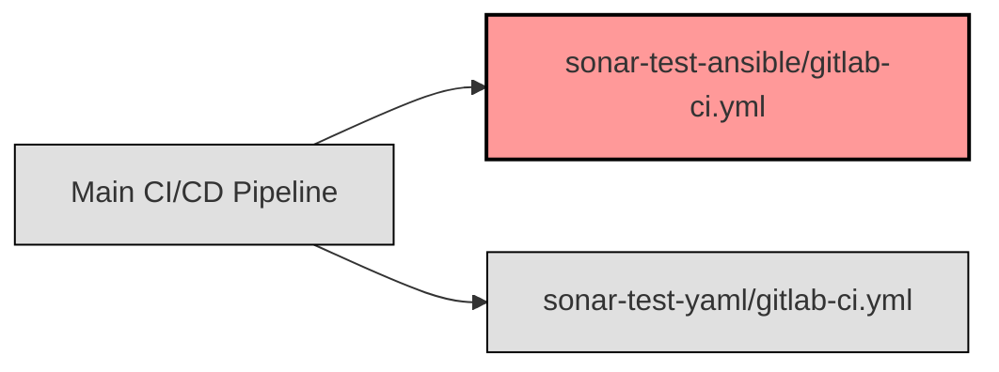

## GitLab CI/CD Ansible-Pipeline [^1] [^2] [^3]

### Einführung

Auch diese Sub GitLab CI/CD Pipeline ist so konfiguriert, dass sie nur ausgeführt wird, wenn sie von einer übergeordneten Pipeline ausgelöst wird.

Dabei läuft zuerst ein build Stage mit einem Python Image, in dem `ansible-lint` und `ansible` installiert werden. Dieses Image wird als Artefakt für die folgende Stage gespeichert.

In der test Stage wird ein SonarQube Scanner Image verwendet, um die Ansible-Dateien zu analysieren. Dabei wird das Artefakt aus der build Stage verwendet.

In der validate Stage wird überprüft, ob die Jobs `sonar` erfolgreich waren.



### Konfiguration

Die Konfiguration für die GitLab CI/CD Pipeline befindet sich im Repository in der Datei `test/sonar-test-ansible/gitlab-ci.yml`.

```yaml
workflow:
  rules:
    - if: $CI_PIPELINE_SOURCE == "parent_pipeline"  # Only execute the pipeline if it is triggered by a parent pipeline

stages:
  - build
  - test
  - validate

setup:
  stage: build
  image: swisscom-docker-local.artifactory.swisscom.com/python:3.9-slim
  variables:
    ANSIBLE_LINT_VERSION: "6.22.2"
    ANSIBLE_VERSION: "8.7.0"
  script:
    - pip3 config set global.index-url https://artifactory.swisscom.com/artifactory/api/pypi/pypi-remote/simple
    - pip3 config get global.index-url
    - pip3 install ansible-lint==${ANSIBLE_LINT_VERSION} ansible==${ANSIBLE_VERSION} --ignore-installed packaging
  artifacts:
    paths:
      - $HOME/.local/bin/
    expire_in: 1 hour

sonar:
  stage: test
  image:
    name: remote-docker.artifactory.swisscom.com/sonarsource/sonar-scanner-cli:5.0
    entrypoint: [""]
  variables:
    SONAR_USER_HOME: "${CI_PROJECT_DIR}/.sonar"  # Defines the location of the analysis task cache
    GIT_DEPTH: "0"  # Tells git to fetch all the branches of the project, required by the analysis task
  cache:
    key: "${CI_JOB_NAME}"
    paths:
      - .sonar/cache
  script:
    - export PATH=$HOME/.local/bin:$PATH
    - export ANSIBLE_CONFIG=./ansible.cfg
    - sonar-scanner
  allow_failure: true
  dependencies:
    - setup

# Validation Stage
ensure-jobs-added:
  stage: validate
  image: remote-docker.artifactory.swisscom.com/badouralix/curl-jq:latest
  variables:
    GIT_STRATEGY: none
  dependencies: []
  script:
    - |
      expectedJobs="sonar"
      route="${CI_API_V4_URL}/projects/$CI_PROJECT_ID/pipelines/$CI_PIPELINE_ID/jobs"
      # JobToken seems not allowed to download own child pipeline jobs (404), therefore using an api-token instead
      # curl -sS -H "JOB-TOKEN: $CI_JOB_TOKEN" $route -o jobs.json -w "%{http_code}"
      httpCode=$(curl -sS -H "Authorization: Bearer $GITLAB_TEST_TOKEN" $route -o jobs.json -w "%{http_code}")
      if [ "$httpCode" != "200" ]; then
        echo "Failed to load jobs from $route ($httpCode)"
        exit 1
      fi
      for job in $expectedJobs; do
        echo "Validate job: $job"
        count=`jq --arg job "$job" 'map(select(.name | contains($job))) | length' jobs.json`
        if [ "$count" != "1" ]; then
          echo "$job is missing"
          exit 1;
        fi
        status=`jq -r --arg job "$job" 'map(select(.name == $job)) | map(.status) | .[0]' jobs.json`
        if [ "$status" != "success" ]; then
          echo "$job was not successful"
          exit 1;
        fi
      done
```
