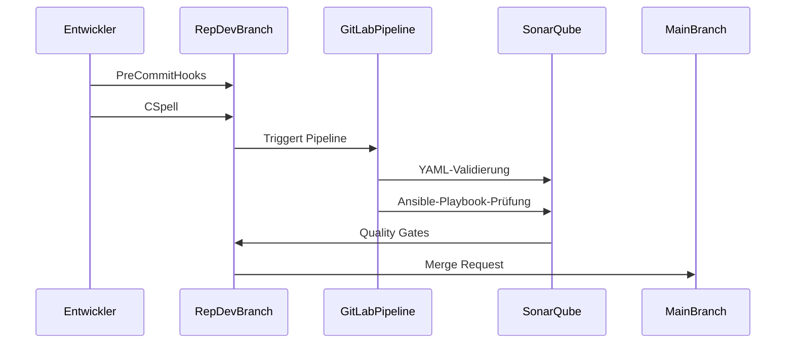

## Deployment-Prozess für neuen Code

Dieser Abschnitt beschreibt den Prozess der Bereitstellung neuen Codes vom Erstellen des Playbooks auf dem Entwickler-System bis zum erfolgreichen Merge in den main branch.

### Prozessbeschreibung

1. **Erstellung des Playbooks**:
   - Der Entwickler erstellt ein neues Ansible-Playbook und fügt es dem Repository hinzu.

2. **Push des Codes**:
   - Der Entwickler pusht den neuen Code in das Git-Repository.

3. **Pre-Commit Hooks**:
   - Vor dem Commit werden Pre-Commit Hooks ausgeführt, um die Einhaltung der Standards sicherzustellen.
   - **CSpell**: Rechtschreibprüfung in Code, Dokumentationen und Kommentaren.
   - **SonarLint Plugin**: Überprüfung des Codes auf Einhaltung der Qualitätsstandards.

4. **CI/CD-Pipeline**:
   - Nach dem Push triggert das Repository die GitLab Pipeline.
   - **YAML-Validierung**: Überprüfung der YAML-Dateien auf Syntaxfehler.
   - **Ansible-Lint**: Spezifische Prüfung der Ansible-Playbooks.
   - **SonarQube**: Statische Codeanalyse zur Erkennung von Code-Problemen, Bugs und Sicherheitslücken.
   - **Pipeline-Validierung**: Überprüfung der Pipeline-Ergebnisse.

5. **Quality Gates**:
   - SonarQube generiert Berichte und überprüft die Qualitätskriterien.
   - Quality Gates validieren die Ergebnisse und entscheiden, ob akzeptiert oder abgelehnt wird.

6. **Merge-Request**:
   - Der Entwickler erstellt ein Merge-Request nachdem das Playbook erfolgreich in der Testumgebung getestet wurde.
   - Der Merge-Request wird überprüft und bei erfolgreicher Validierung in den main branch merged.

7. **Benachrichtigung**:
   - Der Entwickler wird über den erfolgreichen Merge benachrichtigt.
   - Der Code ist nun im main branch verfügbar und kann in der Produktionsumgebung eingesetzt werden.

### Sequence Diagram

