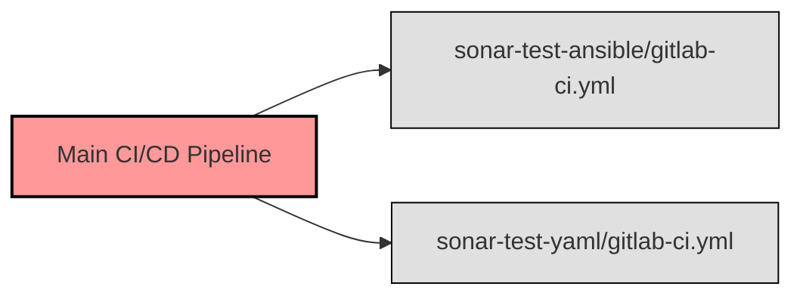

## GitLab Main CI/CD Pipeline [^1]

### Einführung

Ich habe eine GitLab CI/CD Pipeline in dieses Projekt integriert, dass alle Änderungen automatisch mit SonarQube getestet werden. Die Pipeline hat zwei sub-Pipelines, die jeweils für die Tests der YAML- und Ansible-Dateien zuständig sind.
Dabei kann der Workflow einfach umkonfiguriert werden und z.B. auch für den Development-Branch aktiviert werden.



### Konfiguration

Die Konfiguration für die GitLab CI/CD Pipeline befindet sich im Repository in der Datei `.gitlab-ci.yml`. Hier definiere ich die Stufen und Jobs, die bei jedem Commit oder Merge Request ausgeführt werden sollen.

```yaml
# mandatory:
# GITLAB_TEST_TOKEN: token to access gitlab for validation stage

workflow:
  rules:
    - if: $CI_COMMIT_TAG
      when: never             # Do not run when tag
    - if: $CI_PIPELINE_SOURCE == "merge_request_event"  # Run on merge request
    - if: $CI_COMMIT_BRANCH && $CI_OPEN_MERGE_REQUESTS  # Do not run on open merge requests
      when: never
 #   - if: $CI_COMMIT_BRANCH # Run on branch

stages:
  - test

# Run integration test
test-sonar-yaml:
  stage: test
  trigger:
    include: 'test/sonar-test-yaml/.gitlab-ci.yml'
    strategy: depend

# Run integration test
test-sonar-ansible:
  stage: test
  trigger:
    include: 'test/sonar-test-ansible/.gitlab-ci.yml'
    strategy: depend

```

## Quellen und Referenzen

[^1]:GitLab CI/CD Workflow [Retrieved from](https://docs.gitlab.com/ee/ci/yaml/workflow.html)
