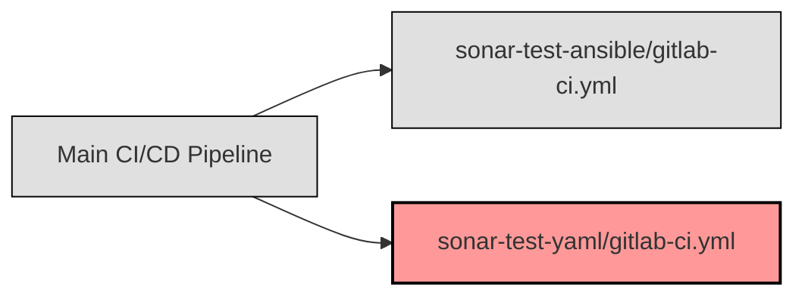

## GitLab CI/CD YAML-Pipeline [^1] [^2] [^3]

### Einführung

Um YAML linting auf SonarQube durchzuführen, habe ich ein zusätzliches [SonarQube Plugin](https://github.com/sbaudoin/sonar-yaml/) installiert.

Wie aus dem letzten Sprint gelernt habe, habe ich intern zuerst nach einer Pipeline Vorlage gesucht, die ich verwenden kann.

Dieses Pipeline-Template binde ich mit einem `include` hier ein.
Mit dem zusätzlichen `inputs` kann der Projekt-Key definiert werden, das auf SonarQube getestet werden soll.

Zusätzlich habe ich ganz nach [GitLab Best Practice](https://docs.gitlab.com/ee/ci/components/#test-the-component) eine Validierung hinzugefügt, die prüft, ob die Jobs erfolgreich waren.



### Konfiguration

Die Konfiguration für die GitLab CI/CD YAML-Pipeline befindet sich im Repository in `test/sonar-test-yaml/.gitlab-ci.yml` und ist eine Sub-Pipeline von `.gitlab-ci.yml`.
Und wird nur ausgeführt, wenn die Pipeline von einer Parent-Pipeline ausgelöst wird.

```yaml
include:
  - component: code.swisscom.com/swisscom/cicd/ci/test-sonar/sonar@~latest
    inputs:
      project-key: "swisscom_mcc-platform_ansible-allgemein_AZHGnNmVP0lb39SI7es6"

workflow:
  rules:
    - if: $CI_PIPELINE_SOURCE == "parent_pipeline"  # Only execute the pipeline if it is triggered by a parent pipeline

variables:
  FF_SCRIPT_SECTIONS: 'true'  # Enable the use of script sections in the pipeline

stages:
  - test
  - validate

# Validation that the pipeline (https://docs.gitlab.com/ee/ci/components/#test-the-component)
ensure-jobs-added:
  stage: validate
  image: remote-docker.artifactory.swisscom.com/badouralix/curl-jq:latest
  variables:
    GIT_STRATEGY: none
  dependencies: []
  script:
    - |
      expectedJobs="sonar"
      route="${CI_API_V4_URL}/projects/$CI_PROJECT_ID/pipelines/$CI_PIPELINE_ID/jobs"
      # JobToken seems not allowed to download own child pipeline jobs (404), therefore using an api-token instead
      # curl -sS -H "JOB-TOKEN: $CI_JOB_TOKEN" $route -o jobs.json -w "%{http_code}"
      httpCode=$(curl -sS -H "Authorization: Bearer $GITLAB_TEST_TOKEN" $route -o jobs.json -w "%{http_code}")
      if [ "$httpCode" != "200" ]; then
        echo "Failed to load jobs from $route ($httpCode)"
        exit 1
      fi
      for job in $expectedJobs; do
        echo "Validate job: $job"
        count=`jq --arg job "$job" 'map(select(.name | contains($job))) | length' jobs.json`
        if [ "$count" != "1" ]; then
          echo "$job is missing"
          exit 1;
        fi
        status=`jq -r --arg job "$job" 'map(select(.name == $job)) | map(.status) | .[0]' jobs.json`
        if [ "$status" != "success" ]; then
          echo "$job was not successful"
          exit 1;
        fi
      done
```

Quellen und Referenzen:

[^1]:GitLab Best Practice [Retrieved from](https://docs.gitlab.com/ee/ci/components/#test-the-component)
[^2]:GitLab CI/CD Workflow [Retrieved from](https://docs.gitlab.com/ee/ci/yaml/workflow.html)
[^3]:SonarQube Plugin [Retrieved from](https://github.com/sbaudoin/sonar-yaml/?tab=readme-ov-file)
